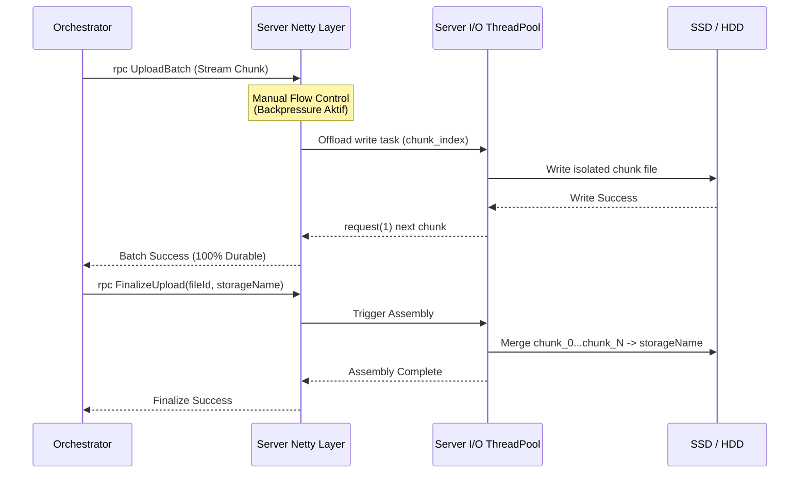

# Desain Arsitektur gRPC Server (Node Storage) - Production Grade

Dokumen ini menjabarkan desain implementasi **Production-Grade** untuk Node Storage. Desain ini telah direvisi secara menyeluruh untuk mengatasi ancaman serius seputar **I/O Blocking, Idempotency, Ordering Corruption, dan Thread Starvation** pada level arsitektur terdistribusi.

## 1. Arsitektur Komunikasi File Upload
Sistem memisahkan tanggung jawab antara *Ingestion* dan *Storage* dengan sangat tegas:
1. **Lapis Ingestion (Orchestrator):** Memvalidasi auth, mengatur *rate-limit*, melacak urutan chunk, dan mengirim batch via gRPC Streaming.
2. **Lapis Storage (Server):** Bertindak murni sebagai "Pekerja Keras Disk". Ia menerima pecahan secara *streaming*, memindahkannya dari Netty ke *Disk Executor*, menulis tiap pecahan ke *isolated staging file* secara idempoten, dan merakitnya (*assembly*) hanya ketika sinyal finalisasi tiba.



## 2. Kontrak Protobuf (`storage.proto`)
Pembaruan Arsitektural: Menambahkan parameter `storage_name` pada `FinalizeRequest` agar Client (Orchestrator) berkuasa mutlak menentukan penamaan file (*Amazon S3-Like pattern*).

```protobuf
syntax = "proto3";

package storage;

option java_multiple_files = true;
option java_package = "io.github.faizul.storage.grpc";

service StorageService {
  rpc UploadBatch(stream UploadChunkRequest) returns (UploadBatchResponse);
  rpc FinalizeUpload(FinalizeRequest) returns (FinalizeResponse);
}

message UploadChunkRequest {
  string file_id = 1;
  int32 chunk_index = 2; // Mutlak diperlukan untuk Idempotency & Assembly
  bytes data = 3;
}

message UploadBatchResponse {
  string file_id = 1;
  bool success = 2;
  string message = 3;
}

message FinalizeRequest {
  string file_id = 1;
  string storage_name = 2; // Nama unik yang diciptakan oleh Orchestrator
}

message FinalizeResponse {
  string file_id = 1;
  bool success = 2;
}
```

## 3. Resolusi Masalah Arsitektural (Kritik Produksi Terpecahkan)

### A. Blocking I/O & Thread Starvation
**Masalah:** Metode standar gRPC Java berjalan di *Netty Event Loop*. Pemanggilan disk I/O di sini akan mencekik seluruh jaringan.
**Solusi:** Semua penulisan file di- *offload* secara eksplisit ke `ExecutorService` khusus (Server I/O Pool).

### B. Idempotency, Ordering Corruption & Recovery
**Masalah:** Menempel data (*Raw Append*) langsung ke ujung satu file besar sangat rentan korup jika urutan jaringan kacau atau jika Orchestrator mengirim ulang (*retry*) batch yang terputus.
**Solusi:** Server menggunakan **Staging Area**. Setiap pecahan data disimpan sebagai file individual: `temp/{fileId}/chunk_{index}`. Jika Orchestrator *retry* pengiriman, *chunk* akan dioverwrite secara idempoten.

### C. True Backpressure Control (Flow Control)
**Masalah:** Streaming klien yang memompa data buta arah dapat melebihi kecepatan tulis hardisk server, menyebabkan Server OOM.
**Solusi:** Menggunakan API tingkat lanjut gRPC: `ServerCallStreamObserver.disableAutoInboundFlowControl()`. Server memegang kendali *TCP Receive Buffer* dengan memanggil `.request(1)` ke jaringan **hanya setelah** I/O pekerja selesai menulis *chunk* sebelumnya ke hardisk!

## 4. Referensi Implementasi Java (Production-Ready Anti-Blocking Server)

```java
import io.grpc.stub.ServerCallStreamObserver;
import io.grpc.stub.StreamObserver;
import net.devh.boot.grpc.server.service.GrpcService;
import java.io.IOException;
import java.nio.file.*;
import java.util.concurrent.ExecutorService;
import java.util.concurrent.Executors;

@GrpcService
public class StorageGrpcService extends StorageServiceGrpc.StorageServiceImplBase {

    // Dedicated Thread Pool khusus menanggung beban Disk I/O Server
    // Mengamankan Netty dari I/O Blocking!
    private final ExecutorService diskIoExecutor = Executors.newFixedThreadPool(20);

    @Override
    public StreamObserver<UploadChunkRequest> uploadBatch(StreamObserver<UploadBatchResponse> responseObserver) {
        
        // Casting untuk mengakses API Backpressure
        ServerCallStreamObserver<UploadBatchResponse> serverResponseObserver = 
            (ServerCallStreamObserver<UploadBatchResponse>) responseObserver;
            
        // 1. AKTIFKAN MANUAL FLOW CONTROL (Backpressure On!)
        serverResponseObserver.disableAutoInboundFlowControl();

        class BatchStreamObserver implements StreamObserver<UploadChunkRequest> {
            private String fileId;

            @Override
            public void onNext(UploadChunkRequest request) {
                fileId = request.getFileId();
                
                // 2. OFFLOAD I/O: Lempar penulisan disk ke pekerja khusus
                diskIoExecutor.submit(() -> {
                    try {
                        // 3. IDEMPOTENT & DURABLE STAGING
                        // Jangan raw append! Tulis secara diskrit.
                        Path stagingDir = Paths.get("/storage/staging", fileId);
                        Files.createDirectories(stagingDir);
                        
                        Path chunkPath = stagingDir.resolve("chunk_" + request.getChunkIndex());
                        Files.write(chunkPath, request.getData().toByteArray(), 
                                StandardOpenOption.CREATE, StandardOpenOption.TRUNCATE_EXISTING);
                        
                        // 4. MINTA DATA LAGI (Tarik 1 chunk berikutnya dari jaringan)
                        // Inilah yang mengamankan server dari OOM!
                        serverResponseObserver.request(1);
                        
                    } catch (IOException e) {
                        serverResponseObserver.onError(e);
                    }
                });
            }

            @Override
            public void onError(Throwable t) {
                // Log and cleanup staging area if necessary
            }

            @Override
            public void onCompleted() {
                // Sinyal bahwa seluruh aliran berhasil masuk dan ditulis
                responseObserver.onNext(UploadBatchResponse.newBuilder()
                        .setFileId(fileId)
                        .setSuccess(true)
                        .build());
                responseObserver.onCompleted();
            }
        }

        BatchStreamObserver observer = new BatchStreamObserver();
        
        // Pancing aliran pertama agar klien mulai mengirim bytes
        serverResponseObserver.request(1);
        return observer;
    }

    @Override
    public void finalizeUpload(FinalizeRequest request, StreamObserver<FinalizeResponse> responseObserver) {
        // Offload perakitan (merging) yang memakan I/O ke thread disk
        diskIoExecutor.submit(() -> {
            try {
                // 5. ASSEMBLY STAGE: Rakit semua chunk_{index} menjadi satu file utuh
                Path stagingDir = Paths.get("/storage/staging", request.getFileId());
                Path finalPath = Paths.get("/storage/public", request.getStorageName());
                
                // [Logika Bisnis: Looping membaca isi stagingDir dan merge (append) ke finalPath]
                // [Setelah sukses: hapus stagingDir beserta isinya secara rekursif]
                
                responseObserver.onNext(FinalizeResponse.newBuilder()
                        .setFileId(request.getFileId())
                        .setSuccess(true)
                        .build());
                responseObserver.onCompleted();
            } catch (Exception e) {
                responseObserver.onError(e);
            }
        });
    }
}
```
